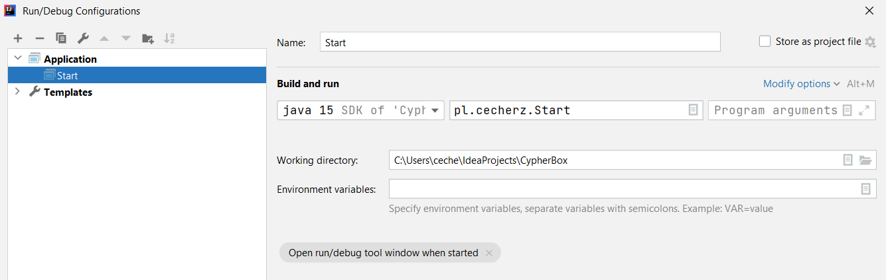

# CypherBox

## Description
Protect your identity. Small helpful tools for advanced users.

### Requirements
* JDK 15

## Deployment guide

#### General information

1) Download and unpack **JDK** from
   [Oracle](https://www.oracle.com/java/technologies/javase-jdk15-downloads.html)
   (Windows x64 Compressed Archive)
2) Add Java to the PATH on **Windows 10** - [HELP](https://www.architectryan.com/2018/03/17/add-to-the-path-on-windows-10)
3) Clone repository using **GIT** or download zip archive.
4) Open project in your favourite IDE or compile class from command line.

#### Run project using IntelliJ IDEA
1) Download [IntelliJ IDEA Community](https://www.jetbrains.com/idea/)
2) Clone project from Github - [HELP](https://www.jetbrains.com/help/idea/manage-projects-hosted-on-github.html)
3) Select **Run** -> **Edit Configurations**
4) Add new configuration for **Java Application**



5) Select **File** -> **Invalidate Cache / Restart** 

## Utils

#### Maven and JUnit
1) Click right click on project name and choose **Add Framework Support** -> **Maven**
2) Build **pom.xml** using archetype **maven-archetype-quickstart** [DOC](https://maven.apache.org/guides/getting-started/#how-do-i-make-my-first-maven-project)

#### Mockito

1) You must visit site: [search.maven.org](https://search.maven.org/artifact/org.mockito/mockito-core)
2) Copy content from **Apache Maven** in grey checkbox:

```xml
<dependency>
  <groupId>org.mockito</groupId>
  <artifactId>mockito-core</artifactId>
  <version>3.7.7</version>
</dependency>
```

3) Reload **Maven** dependencies

## Author
* Kamil Cecherz as [pangeon](https://github.com/pangeon)
